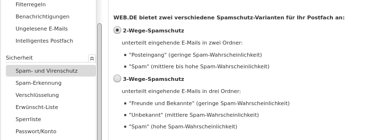

To use your web.de email address with Delta Chat you have to enable IMAP access. Please see [web.de's own article on how to do that](https://hilfe.web.de/pop-imap/einschalten.html).

Afterwards you can use Delta Chat with your web.de email address and the newly created password.

## Disable 3-Way Spam Protection

If the 3-Way Spam Protection is enabled in the web.de settings, Delta Chat
won't work as expected, as all emails by unknown contacts will be moved to the
"Unbekannt" folder instead of the Inbox. 

If you want to receive contact requests, you should downgrade it to 2-Way Spam
Protection, as described here:
[https://hilfe.web.de/email/spam-und-viren/spamschutz-einstellungen.html](https://hilfe.web.de/email/spam-und-viren/spamschutz-einstellungen.html)

One more tip: In case you find that Delta Chat messages are not moved into the designated "DeltaChat"-folder of your email account, please make sure that you have less than 40 folders altogether. Apparently web.de allows only for 40 folders. Note that also folders in the trash do count.
